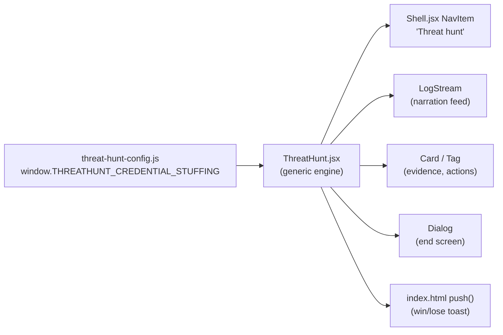

<!-- 72ecd955-faa3-4612-82a6-65dadddc3541 -->
---
todos:
  - id: "schema"
    content: "Write ThreatHunt.d.ts config contract (nodes, exits, evidence, decision, endings)"
    status: pending
  - id: "config"
    content: "Author threat-hunt-config.js: credential-stuffing guest-portal hunt"
    status: pending
  - id: "engine"
    content: "Build ThreatHunt.jsx engine (briefing, timer, narration LogStream, evidence, decision, end Dialog)"
    status: pending
  - id: "wire-nav"
    content: "Add Threat hunt NavItem to Shell.jsx"
    status: pending
  - id: "wire-view"
    content: "Wire threathunt view, scripts, TITLES, and toast outcomes into index.html"
    status: pending
  - id: "docs"
    content: "Write docs/threat-hunt-mud.md authoring guide; update ui_kits/noc-console/README.md and CHANGELOG.md"
    status: pending
  - id: "verify"
    content: "Run contract tests and manually exercise the game at 1440x900 and 1024px"
    status: pending
isProject: false
---

## Where it lives

New sidebar section in `ui_kits/noc-console/`, alongside Overview / Alerts / Sessions / Sensors — same `view` state-swap pattern already used in [ui_kits/noc-console/index.html](ui_kits/noc-console/index.html), same nav pattern in [ui_kits/noc-console/Shell.jsx](ui_kits/noc-console/Shell.jsx). No new UI kit, no backend, no build step — this repo's ui_kits are static Babel-in-browser React, and `_ds_bundle.js` only hashes `components/**`, not `ui_kits/**`, so this is a clean, low-risk addition that composes only already-published primitives (`Card`, `LogStream`, `Tag`, `Button`, `Badge`, `Dialog`, `Progress`).

## Tone

Fully security-native, per the existing brand voice in [README.md](README.md) ("shift handover note" register, no theatrics, no "you", fixed action vocabulary `Acknowledge · Isolate · Allow · Block · Escalate · Dismiss`). No dungeons, monsters or HP. "Rooms" are log sources / hosts / network segments. "Exits" are investigative pivots. "Combat" is choosing the correct containment action under time pressure.

## Architecture

The config is the "MUD as code" artifact: a plain JS object describing nodes (log sources), exits (pivots), evidence, a decision node with containment choices, and endings. The engine (`ThreatHunt.jsx`) is generic — it never hardcodes scenario content, only reads the config shape. A second, third, etc. threat hunt is authored the same way and swapped in via the `config` prop; no engine change needed (this pass ships one fully authored hunt as the proof, per your answer).

## Config schema (the "MUD as code" contract)

New `ui_kits/noc-console/ThreatHunt.d.ts` documents the shape:

- `meta`: `{ title, briefing, targetSeconds }` — the walk-up briefing card and the ~3 minute soft target (shown, not a hard fail).
- `startNode`: id of the first node.
- `nodes`: map of `nodeId -> { name, tag, narration, evidence?, exits?, isDecision?, actions? }`
  - `narration`: security-voice text appended to the `LogStream` feed each time the node is entered (present tense, no "you", numbers first — same rules as the rest of the system).
  - `evidence`: `{ id, label, detail }[]` collected into a de-duplicated set, rendered as `Tag` chips.
  - `exits`: `{ to, label, tag, requiresEvidence? }[]` — pivot buttons; `requiresEvidence` (a count) gates an exit until the player has gathered enough evidence, so the "decision" doesn't just get click-spammed immediately.
  - `isDecision` + `actions`: `{ id, label, correct, resultNote }[]` — the containment choices at the end of the trail. All actions render with equal visual weight (no styling hint at which is correct).
- `endings`: `{ win, lose, timeout }`, each `{ title, narration }` shown in the end `Dialog`.

## Engine behavior (`ui_kits/noc-console/ThreatHunt.jsx`)

- Briefing state: `Card` with `meta.briefing`, a "Start hunt" `Button`.
- Playing state: elapsed-time counter (mono, tabular-nums, ticking via `setInterval`) compared against `targetSeconds` (badge tone flips `ok` → `warn`, never a hard fail — matches the "forgiving, not punishing" MUD design principle from research); `LogStream` narration feed (`follow live`); right rail `Card`s for "Evidence" (`Tag` list) and "Available actions" (exit `Button`s, disabled with a hint until `requiresEvidence` is met); at the decision node, the containment-action `Button`s replace the exits.
- Resolution: clicking a decision action calls `onAction(...)` (the same `push` toast pipeline every other console action already uses in [ui_kits/noc-console/index.html](ui_kits/noc-console/index.html)), then opens a `Dialog` end screen with elapsed time, correct/incorrect, the ending narration, and "Play again" (resets local state, same config) / "Close".
- No persistence, no backend — pure client state, consistent with the rest of this repo's mock-data ui_kits.

## Content: one authored demo hunt

`ui_kits/noc-console/threat-hunt-config.js` — "Credential stuffing, guest portal", reusing the exact incident already referenced in this repo's own content voice example (`README.md`: `41.2.19.7 → guest-portal · 2,904 attempts`). Trail: alert queue → DNS logs / proxy logs / identity provider (evidence, one is a legitimate "ruled out" lead, not a punishing dead end) → attribution → decision (`Block source` correct; `Isolate client` and `Escalate` present with honest resultNotes explaining why they're not the right first move here).

## Integration points

- [ui_kits/noc-console/Shell.jsx](ui_kits/noc-console/Shell.jsx): add `NavItem icon="target" label="Threat hunt"` under "Operations", wired to `view === 'threathunt'`.
- [ui_kits/noc-console/index.html](ui_kits/noc-console/index.html): load `threat-hunt-config.js` and `ThreatHunt.jsx`; add a `threathunt` entry to `TITLES`; render `<ThreatHunt d={dd} config={window.THREATHUNT_CREDENTIAL_STUFFING} onAction={push} />`; add `hunt-win` / `hunt-lose` entries to the existing toast `map` so the outcome fires a toast exactly like every other console action.
- [ui_kits/noc-console/README.md](ui_kits/noc-console/README.md): document the new file and add a "Try it" step.
- New `docs/threat-hunt-mud.md`: the authoring guide — full schema reference table, a minimal worked example, the voice rules a new hunt's narration must follow, and "how to add a second hunt" (new config file, one script tag, swap the `config` prop — no engine edit).
- [CHANGELOG.md](CHANGELOG.md): one entry for the new console section.

## Verification

- `node --test tests/design-system-contract.test.mjs tests/template-contract.test.mjs` — confirms the new nav item / view branch don't regress the existing shortcut, safety-path, or compact-layout contracts (none of those tests special-case the view list; they regex-match `Shell.jsx`/`Alerts.jsx`/`Sessions.jsx` content that stays untouched).
- Manual pass at `ui_kits/noc-console/index.html` (1440×900 and the 1024px compact breakpoint): briefing → pivot through all three first-level nodes → decision → win path and one wrong-choice path → Play again.

## Out of scope for this pass (per your answers)

- No scenario picker / multiple hunts wired into the UI (schema supports it; only one is authored now).
- No typed command line (click-only).
- No leaderboard or persistence.
